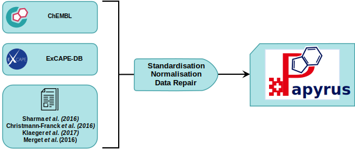

# Papyrus-scripts

Collection of scripts to interact with the Papyrus bioactivity dataset.



<br/>

**Associated Preprint:** <a href="https://doi.org/10.33774/chemrxiv-2021-1rxhk">10.33774/chemrxiv-2021-1rxhk</a>
```
Béquignon OJM, Bongers BJ, Jespers W, IJzerman AP, van de Water B, van Westen GJP.
Papyrus - A large scale curated dataset aimed at bioactivity predictions.
ChemRxiv. Cambridge: Cambridge Open Engage; 2021;
This content is a preprint and has not been peer-reviewed.
```

## Installation

```bash
pip install papyrus-scripts
``` 

:warning: If pip gives the following error and resolves in import errors
```bash
Defaulting to user installation because normal site-packages is not writeable
```
Then uninstall and reinstalling the library with the following commands:
```bash
pip uninstall -y papyrus-scripts
python -m pip install papyrus-scripts
```

Additional dependencies can be installed to allow:
 - similarity and substructure searches
    ```bash
    conda install FPSim2 openbabel h5py cupy -c conda-forge
    ```

- training DNN models:
    ```bash
    conda install pytorch torchvision torchaudio cudatoolkit=11.3 -c pytorch
    ```

## Donwload the dataset

The Papyrus data can be donwload in three different ways.<br/>
**The use of the command line interface is strongly recommended to download the data.**

### - Using the command line interface (CLI)

Once the library is installed (see [*Installation*](https://github.com/OlivierBeq/Papyrus-scripts#installation)),
one can easily download the data.

- The following command will download the Papyrus++ bioactivities and protein targets (high-quality Ki and KD data as well as IC50 and EC50 of reproducible assays) for the latest version.
```bash
papyrus download -V latest
```

- The following command will donwload the entire set of high-, medium-, and low-quality bioactivities and protein targets along with all precomputed molecular and protein descriptors for version 05.5.
```bash
papyrus download -V 05.5 --more --d all 
```

- The following command will download Papyrus++ bioactivities, protein targets and compound structures for both version 05.4 and 05.5.
```bash
papyrus download -V 05.5 -V 05.4 -S 
```

More options can be found using 
```bash
papyrus download --help 
```

By default, the data is downloaded to [pystow](https://github.com/cthoyt/pystow)'s default directory.<br/>
One can override the folder path by specifying the `-o` switch in the above commands.

### - Using the application programming interface (API)

```python

from papyrus_scripts import download_papyrus

# Donwload the latest version of the entire dataset with all precomputed descriptors
download_papyrus(version='latest', only_pp=False, structures=True, descriptors='all')
```

### - Directly from online archives 

Different online servers host the Papyrus data based on release and ChEMBL version (table below).

 
| Papyrus version | ChEMBL version |                                Zenodo                                |                            4TU                            |                                                Google Drive                                                 |
|:---------------:|:--------------:|:--------------------------------------------------------------------:|:---------------------------------------------------------:|:-----------------------------------------------------------------------------------------------------------:|
|      05.4       |       29       |                                 :x:                                  | [:heavy_check_mark:](https://doi.org/10.4121/16896406.v2) | [:heavy_check_mark:](https://drive.google.com/drive/folders/1Lhw5G6gu_nLzHQoGmnl02uhFsmOgEZ5a?usp=sharing)  | 
|      05.5       |       30       | [:heavy_check_mark:](https://zenodo.org/record/7019874#.Y2lECL3MKUk) |                            :x:                            | [:heavy_check_mark:](https://drive.google.com/drive/folders/1BrCx0lN1YVvjgXOOaJZHJ7DBrLqFAbWV?usp=sharing)  |
|      05.6       |       31       | [:heavy_check_mark:](https://zenodo.org/record/7377161#.Y5BvrHbMKUk) |                            :x:                            |                                                     :x:                                                     |

Precomputed molecular and protein descriptors along with molecular structures (2D for default set and 3D for low quality set with stereochemistry) are not available for version 05.4 from 4TU but are from Google Drive.

As stated in the pre-print **we strongly encourage** the use of the dataset in which stereochemistry was not considered.
This corresponds to files containing the mention "2D" and/or "without_stereochemistry". 

## Interconversion of the compressed files

The available LZMA-compressed files (*.xz*) may not be supported by some software (e.g. Pipeline Pilot).
<br/>**Decompressing the data is strongly discouraged!**<br/>
Though Gzip files were made available at 4TU for version 05.4, we now provide a CLI option to locally interconvert from LZMA to Gzip and vice-versa.

To convert from LZMA to Gzip (or vice-versa) use the following command:
```bash
papyrus convert -v latest 
```

## Removal of the data

One can remove the Papyrus data using either the CLI or the API.

The following exerts exemplify the removal of all Papyrus data files, including all versions utility files. 
```bash
papyrus clean --remove_root
```

```python
from papyrus_scripts import remove_papyrus

remove_papyrus(papyrus_root=True)
```


## Easy handling of the dataset

Once installed the Papyrus-scripts allow for the easy filtering of the data.<br/>
- Simple examples can be found in the <a href="notebook_examples/simple_examples.ipynb">simple_examples.ipynb</a> notebook. [](https://colab.research.google.com/github/OlivierBeq/Papyrus-scripts/blob/master/notebook_examples/simple_examples.ipynb)
- An example on matching data with the Protein Data Bank can be found in the <a href="notebook_examples/matchRCSB.ipynb">simple_examples.ipynb</a> notebook. [](https://colab.research.google.com/github/OlivierBeq/Papyrus-scripts/blob/master/notebook_examples/matchRCSB.ipynb)
- More advanced examples will be added to the <a href="notebook_examples/advanced_querying.ipynb">advanced_querying.ipynb</a> notebook.
## Reproducing results of the pre-print

The scripts used to extract subsets, generate models and obtain visualizations can be found <a href="https://github.com/OlivierBeq/Papyrus-modelling">here</a>.

## Features to come

- [x] Substructure and similarity molecular searches
- [x] ability to use DNN models
- [ ] adapt models to QSPRpred
- [x] ability to repeat model training over multiple seeds
- [ ] y-scrambling
 
## Examples to come

- Use of custom grouping schemes for training/test set splitting and cross-validation
- Use custom molecular and protein descriptors (either Python function or file on disk) 


## Logos

Logos can be found under <a href="figures/logo">**figures/logo**</a>
Two version exist depending on the background used.

:warning: GitHub does not render the white logo properly in the table below but should not deter you from using it! 

<div class="colored-table">

|                                                              On white background                                                              |                     On colored background                     |
|:---------------------------------------------------------------------------------------------------------------------------------------------:|:-------------------------------------------------------------:|
|                                                                                        |  |

</div>


